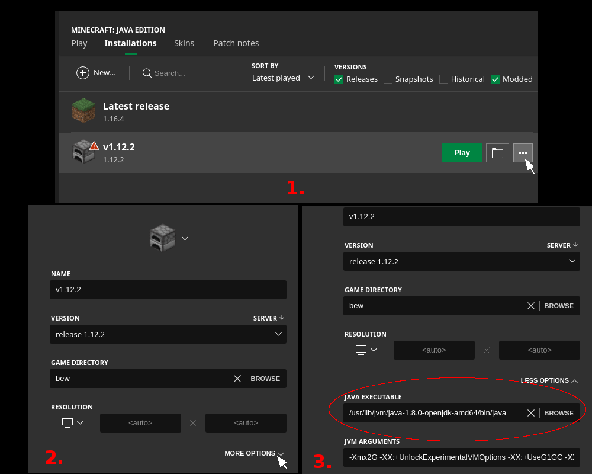

# Evocraft-py
A Python interface for Minecraft built on [grpc](https://github.com/real-itu/minecraft-rpc). 
<br />

### 1. Set-up

1. Install Java 8 -aka 1.8- (you can check your version with `java -version`)

   - Unix: `sudo apt-get install openjdk-8-jre`
   - OSX: 
     - `brew tap AdoptOpenJDK/openjdk`
     - `brew cask install adoptopenjdk8`
     - If troubles, check: [how to install Java on Mac OS](https://mkyong.com/java/how-to-install-java-on-mac-osx/) 
   - Windows: [Java 8 for Windows](https://www.oracle.com/java/technologies/javase/javase-jdk8-downloads.html) 


2. Clone repo and install grpc:

   - `git clone https://github.com/real-itu/Evocraft-py`
   - `pip install grpc`

   a. On Linux (Ubuntu):

      - `git clone https://github.com/real-itu/Evocraft-py`
      - `pip install grpcio google`
      - `pip install --upgrade google-api-python-client`


### 2. Starting the modded Minecraft server

1. From `Evocraft-py`, start the server with `java -jar spongevanilla-1.12.2-7.3.0.jar`
2. The first time you try to start the server a texfile eula.txt with be generated, you need to modifying its last line to `eula=true` to accept the Minecraft EULA. Now running `java -jar spongevanilla-1.12.2-7.3.0.jar` will start the server
3. You should see a bunch of outputs including `[... INFO]: Listening on 5001`. 
This means it's working and the Minecraft server is ready for commands on port 5001.

### 3. Spawn blocks on the Minecraft server with Python 

There are three methods at the core of the API: `spawnBlocks` spawns a set of different blocks,
`fillCube` spawns a single type of block over a cubic volume and `readCube` which reads currently spawned blocks within a space.

Here's [example](example.py) on how to spawn a flying machine with python (you'll need to have started the modded Minecraft server before):

```python
import grpc

import minecraft_pb2_grpc
from minecraft_pb2 import *

channel = grpc.insecure_channel('localhost:5001')
client = minecraft_pb2_grpc.MinecraftServiceStub(channel)

client.fillCube(FillCubeRequest(  # Clear a 20x10x20 working area
    cube=Cube(
        min=Point(x=-10, y=4, z=-10),
        max=Point(x=10, y=14, z=10)
    ),
    type=AIR
))
client.spawnBlocks(Blocks(blocks=[  # Spawn a flying machine
    # Lower layer
    Block(position=Point(x=1, y=5, z=1), type=PISTON, orientation=NORTH),
    Block(position=Point(x=1, y=5, z=0), type=SLIME, orientation=NORTH),
    Block(position=Point(x=1, y=5, z=-1), type=STICKY_PISTON, orientation=SOUTH),
    Block(position=Point(x=1, y=5, z=-2), type=PISTON, orientation=NORTH),
    Block(position=Point(x=1, y=5, z=-4), type=SLIME, orientation=NORTH),
    # Upper layer
    Block(position=Point(x=1, y=6, z=0), type=REDSTONE_BLOCK, orientation=NORTH),
    Block(position=Point(x=1, y=6, z=-4), type=REDSTONE_BLOCK, orientation=NORTH),
    # Activate
    Block(position=Point(x=1, y=6, z=-1), type=QUARTZ_BLOCK, orientation=NORTH),
]))
```

To read the blocks present within a set of coordinates use `readCube`:

```python
import grpc

import minecraft_pb2_grpc
from minecraft_pb2 import *

channel = grpc.insecure_channel('localhost:5001')
client = minecraft_pb2_grpc.MinecraftServiceStub(channel)

blocks = client.readCube(Cube(
         min=Point(x=0, y=0, z=0),
         max=Point(x=10, y=10, z=10)
))

print(blocks)
```


You can see the implemented Python methods at [minecraft_pb2_grpc.py](minecraft_pb2_grpc.py#L37).
For the general grpc definition please see [minecraft-rpc](https://github.com/real-itu/minecraft-rpc).

If you'd like to interface with the server using other languages than Python, you can use the interface definition file you can generate clients for (almost) any programming language you like. See [https://grpc.io/docs/languages/](https://grpc.io/docs/languages/) and [minecraft-rpc](https://github.com/real-itu/minecraft-rpc).

### 4. Rendering Minecraft

You can use the method `client.readCube` that allows to read which blocks are spawned, however, if you'd like to render Minecraft to see what your spawned creations look like or even interact with them, you'll need to buy and install [Minecraft](https://www.minecraft.net)

1. Install and launch Minecraft
2. Create a compatible version:
   1. `Installations` 
   2. `New`
   3. Give it a name
   4. Select version 1.12.2 
   5. `Create`
3. Launch it:
   1. `Play`
   2. `Multiplayer`
   3. `Direct Connect`
   4. On `Server Address` write `localhost` 
   5. `Join Server`

On the server command line, you can use /tp @p x y z to teleport yourself to position {x,y,z} in the world.

### Et voilà:

<p align="center">
  
</p>  

</br>  

# Evolutionary algorithms implemented with the API

In this section we'll compile implementations of evolutionary algorithms using the API

 - [**Interactive evolution**](https://github.com/claireaoi/EvoCraft-interactive): Evolve Minecraft entities interactively.
 - [**Simple tower evolution in Python**](https://github.com/real-itu/simple_minecraft_evolver): Evolve tower that reach for a golden block in the sky.


</br>  

 ## Citation   

 If you use the code for academic or commecial use, please cite the associated paper:

 ```bibtex

@article{Grbic2020Dec,
	author = {Djordje Grbic, Rasmus Berg Palm, Elias Najarro, Claire Glanois, Sebastian Risi},
	title = {{EvoCraft: A New Challenge for Open-Endedness}},
	journal = {arXiv},
	year = {2020},
	month = {Dec},
	eprint = {2012.04751},
	url = {https://arxiv.org/abs/2012.04751v1}
}
```
 
### Troubleshooting

Perhaps you're having a bit of a problem setting up or running Evocraft to your satisfaction, but don't despair! Chances are someone else has encountered the same problem before, and if not, here's your chance to tackle the problem and document your solution to help those that run into the same thing later. Please feel free to raise an issue if you can't get something to work, and we'll add the solution to this troubleshooting section after figuring it out. Here are some issues we've already encountered:

#### Using the right Java version

There may be more than one version of Java installed on your machine, for example the Minecraft launcher tends to install Java 1.12 and use it by default, even if you've previously installed Java 1.8 and only Java 1.8. To list the currently installed versions, use 

```   
update-java-alternatives --list
```

Look for the one that includes `java-1.8` to find the path to use with Evocraft. If another Java version is your default, you can specify the 'java-1.8' path when launching an Evocraft server. For example, it may look something like this

```
/usr/lib/jvm/java-1.8.0-openjdk-amd64/bin/java -jar spongevanilla-1.12.2-7.3.0.jar
```

If you're using your offical Minecraft to render/interact with Evocraft, you'll want to make sure that Minecraft is using the same Java version 1.12.2. In the Minecraft launcher under installations, select your v1.12.2 installation and click on the ellipsis symbol to choose options. In the options tab, choose "MORE OPTIONS", where you should see a field to specify the Java executable. Paste the same path as used above when launching Evocraft into this box and you should now be able to launch your v1.12.2 Minecraft without any problems. 


<p align="center">
  
</p>  
